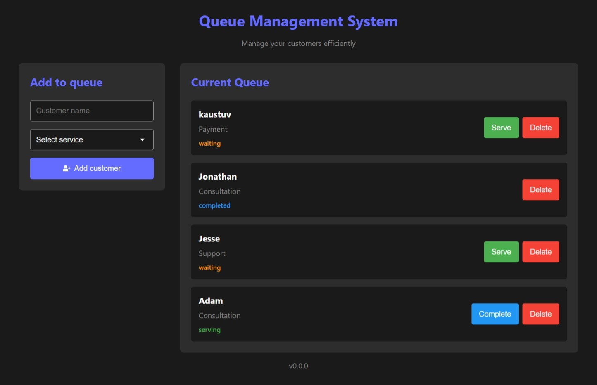

# Queue Management System

A simple, clean, and beginner-friendly **Queue Management System** built with React.  
It demonstrates a complete **CRUD workflow** — creating tickets, updating their status, and deleting them — wrapped in a neat UI.

This is **v0.0.0**, the first functional version of the project.

---

## 🚀 Features

- **Add customers to the queue**
  - Enter a customer name
  - Select a service (out of 3 predefined options)
  - Generate a new queue ticket

- **View all active tickets**
  - Displayed in a structured “Current Queue” section
  - Each ticket shows:
    - Customer name  
    - Selected service  
    - Current status  

- **Update ticket status**
  - Tickets start in **waiting** (default)
  - Status can be changed to:
    - **serving**
    - **completed**
  - Buttons update dynamically based on the ticket state

- **Delete tickets**
  - Remove any ticket from the queue instantly

- **Clean Component Structure**
  - **Header** — App title + tagline  
  - **Form Component** — Customer input + service selector  
  - **Queue Display Component** — Interactive ticket cards  

---

## 🎯 CRUD Breakdown

| Action      | Description |
|-------------|-------------|
| **Create**  | Add a new ticket using the form |
| **Read**    | Tickets are displayed in the queue section |
| **Update**  | Ticket status changes: waiting → serving → completed |
| **Delete**  | Ticket can be removed at any time |

---

## 🛠️ Tech Stack

### Frontend

### Styling

### Development

### Deployment

---

## 📸 Screenshot

---

## 📦 Version

`v0.0.0` — First working version of the Queue Management System.

---
